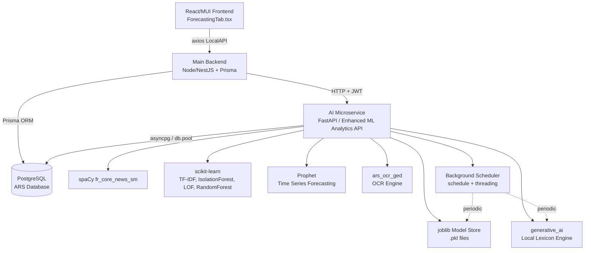
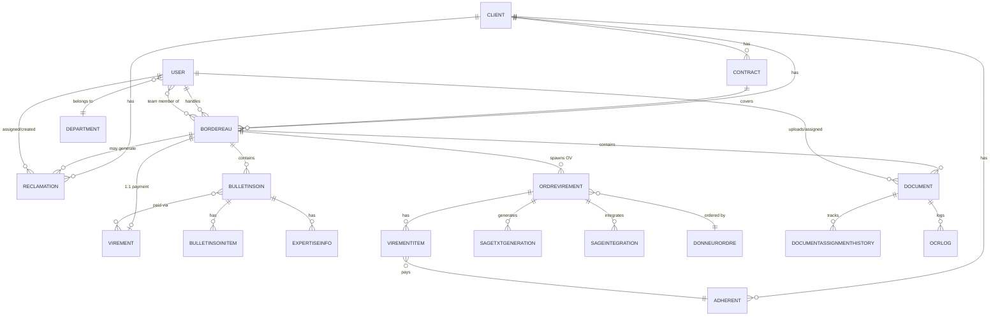
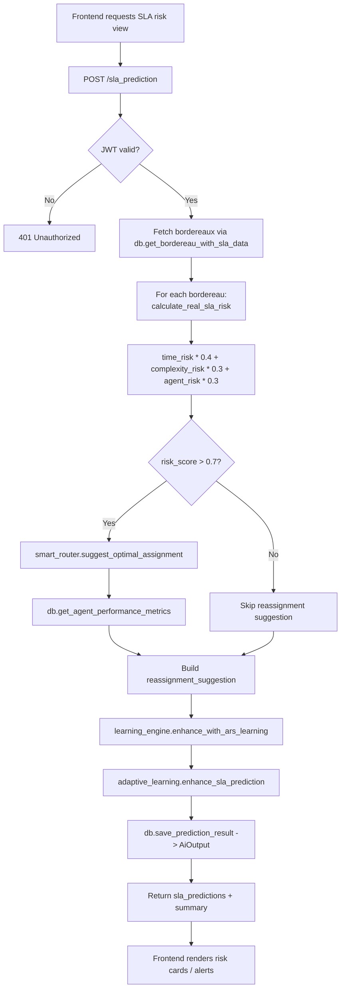
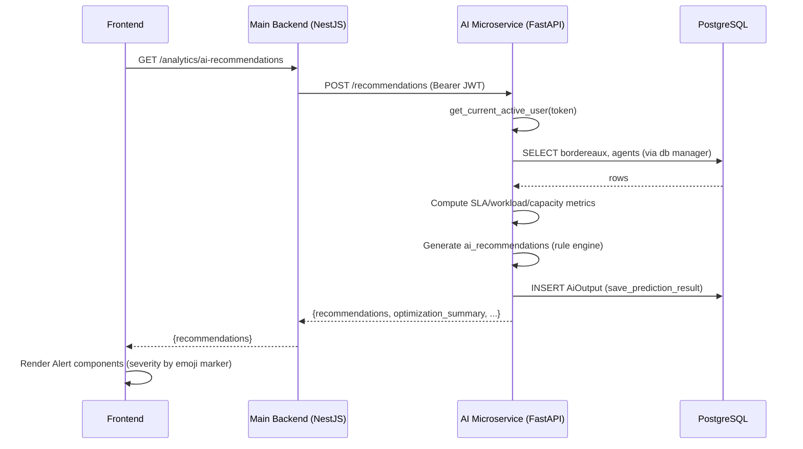

# AI & Schema Summary — ARS GED / Analytics Platform

> Generated from: `ai_microservice.py` (FastAPI ML/AI microservice), `schema.prisma` (PostgreSQL/Prisma data model), `ForecastingTab.tsx` (React/MUI frontend analytics tab).

---

## 1. Executive Summary

### 1.1 Project Overview
The project is **ARS** (Assurance / GEC — "Gestion Électronique de Documents" et de réclamations), a back-office platform used by an insurance-administration company (operating in Tunisia, French-speaking) to manage **bordereaux** (claim batches), **bulletins de soins** (medical care reimbursement slips), **réclamations** (client complaints), **virements** (bank wire transfers / payment orders), and document scanning/OCR (GED). The system integrates with **Sage** accounting software for TXT-file based accounting entries and API-based integration.

A companion **Enhanced ML Analytics API** (FastAPI, Python) provides AI/ML-driven decision support across the operational pipeline: SLA risk prediction, workload optimization, agent reassignment, document classification, complaint intelligence, sentiment analysis, anomaly/clustering detection, forecasting, and generative business insights.

### 1.2 Main Business Purpose
- Digitize and automate the lifecycle of insurance reimbursement bordereaux from reception → scanning → assignment → processing → virement (payment) → Sage accounting integration.
- Track and resolve client complaints (réclamations) with SLA monitoring.
- Use AI/ML to optimize workforce allocation, predict SLA breaches, detect anomalies/bottlenecks, and provide management with executive-level insights and forecasts.
- Provide a recovery ("Recouvrement") and validation gate before payments are accounted/executed, ensuring financial controls.

### 1.3 Core Functionalities
| Domain | Functionality |
|---|---|
| **BO / Scan / GED** | Document reception, scanning, OCR extraction, document classification, document search |
| **Bordereaux Workflow** | Status lifecycle (`EN_ATTENTE` → ... → `PAYE`), assignment, SLA tracking |
| **Bulletins de Soins (BS)** | Item-level reimbursement processing, expertise info, logs |
| **Réclamations** | Complaint intake, classification, auto-reply suggestions, recurrence detection |
| **Finance / Virements** | Ordre de Virement (OV) lifecycle, recovery validation, Sage TXT/API integration, webhook ingestion |
| **AI Analytics** | SLA prediction, reassignment, performance analysis, forecasting, anomaly detection, complaints intelligence, generative insights |
| **Reporting** | Scheduled reports, executive reports, notifications/alerts, escalation rules |
| **Admin/Config** | Departments, team structures, SLA configuration, system configuration, Sage config store |

---

## 2. AI Components Analysis

All AI components are exposed by the **Enhanced ML Analytics API** (`ai_microservice.py`), a FastAPI service (`title="Enhanced ML Analytics API"`, versions `2.0.0`/`3.1.0`), secured via OAuth2 password-flow JWT (`/token`). The service connects to the main PostgreSQL database (`get_db_manager()`), uses **spaCy** (`fr_core_news_sm`), **scikit-learn**, **Facebook Prophet**, and a set of bespoke local modules (no external LLM/cloud AI provider detected — all "generative AI" is **local/rule-based**, not OpenAI/Claude/Gemini).

### 2.1 Component Inventory (Summary Table)

| Component | Endpoint(s) | Model/Technique | Primary Purpose |
|---|---|---|---|
| Recurrent Complaint Detector | `POST /analyze` | TF-IDF + cosine similarity (scikit-learn) | Find duplicate/recurring complaints |
| Response Suggestion | `POST /suggestions` | spaCy NER (`fr_core_news_sm`) | Suggest auto-reply text for a complaint |
| Optimization Recommendations | `POST /recommendations` | Rule-based heuristics over live workload/SLA data | Generate prioritized operational recommendations |
| SLA Breach Predictor (rule engine) | `POST /sla_prediction`, `POST /sla_breach_prediction/train`, `POST /sla_breach_prediction/predict` | Weighted rule-based risk scoring + `advanced_ml_models.sla_predictor` | Predict SLA breach risk per bordereau |
| Priority Scoring | `POST /priorities` | Weighted scoring formula + `explainable_ai.explainer` | Rank bordereaux by urgency |
| Reassignment Engine | `POST /reassignment`, `POST /smart_routing/suggest_assignment`, `POST /analytics/ai/reassign-suggestion` | Weighted agent scoring (performance/speed/workload) | Suggest optimal agent reassignment |
| Performance Analytics AI | `POST /performance`, `POST /diagnostic_optimisation` | `performance_analytics_enhancement.performance_analytics_ai` | Training-needs analysis, root-cause analysis, bottleneck detection, capacity analysis |
| Correlation Analysis | `POST /correlation` | Simple grouping/aggregation | Correlate complaints with processes |
| Comparative Performance | `POST /compare_performance` | Simple delta computation | Planned vs actual comparison |
| Resource Prediction | `POST /predict_resources` | Arithmetic formula | Estimate required managers |
| Forecasting (Trends) | `POST /forecast_trends` | **Facebook Prophet** (+ simple average fallback) | Time-series forecasting of volumes with anomaly/trend analysis |
| Client Load Forecasting | `POST /forecast_client_load` | `ars_forecasting.generate_client_forecast` + staffing calc | Per-client forecast & staffing requirements |
| Anomaly Detection (generic) | `POST /anomaly_detection` | `IsolationForest`, `LocalOutlierFactor` (scikit-learn) | Detect anomalies in arbitrary feature vectors |
| Sophisticated Anomaly Detection | `POST /anomaly_detection` (`detection_type=performance`) | `sophisticated_anomaly_detection` module | Detect performance anomalies per agent |
| Confidence Scoring | `POST /confidence_scoring` | `RandomForestClassifier` + `StandardScaler` | Classification with confidence intervals |
| Model Persistence | `POST /save_model`, `GET /learning/models` | `joblib`, `model_persistence` | Save/list trained models |
| Document Classification | `POST /document_classification/train`, `POST /document_classification/classify` | `advanced_ml_models.document_classifier` (ensemble model) | Classify bordereau documents by status |
| Recurring Issue / Pattern Recognition | `POST /pattern_recognition/recurring_issues`, `POST /pattern_recognition/process_anomalies`, `POST /pattern_recognition/temporal_patterns`, `POST /patterns/analyze` | `pattern_recognition.recurring_detector`, `temporal_analyzer`, custom DB-driven pattern mining | Detect recurring issues, process anomalies, temporal peaks |
| AI Pattern Analysis | `POST /ai/analyze` | Rule-based + frequency/trend analysis over real claims | Pattern detection, predictions, insights, root cause |
| Complaints Intelligence | `POST /complaints_intelligence` | `ars_complaints_intelligence.generate_complaints_intelligence` | Recurrence, correlation, auto-replies, performance ranking |
| Complaint Classification | `POST /classify` | `ars_complaints_intelligence.classify_ars_complaint` + adaptive learning | Classify a complaint and propose GEC auto-reply |
| Sentiment Analysis | `POST /sentiment_analysis` | spaCy + lexicon-based scoring | Determine sentiment (positive/negative/neutral) of free text |
| Smart Routing | `POST /smart_routing/build_profiles`, `POST /smart_routing/train`, `POST /smart_routing/suggest_assignment`, `POST /alert_resolution` | `intelligent_automation.smart_router` | Build team profiles, train routing model, suggest assignment, resolve alerts |
| Automated Decisions | `POST /automated_decisions` | `intelligent_automation.decision_engine` | Context-driven automated decision-making |
| Advanced Clustering | `POST /advanced_clustering`, `POST /pattern_recognition/process_anomalies` (`detection_type=clustering`) | `advanced_clustering.cluster_problematic_processes` | Cluster problematic processes |
| Generative AI (local) | `POST /generate`, `POST /generate/insight`, `POST /generate/feedback` | `generative_ai` module (company-lexicon based, local) | Generate text responses & business insights, learn from feedback |
| Executive Reporting | `POST /generate_executive_report` | Aggregates anomalies + clustering + scoring | Generate executive summary report with AI insights |
| GED OCR / Document Processing | `POST /ged/process_document`, `POST /ged/search`, `GET /ged/stats` | `ars_ocr_ged` (or `pdfplumber`/`PyPDF2` fallback) + regex extraction | OCR document text/data extraction, indexing, search, statistics |
| Alert Resolution / Solution Generator | `POST /alert_solution`, `POST /alert_resolution` | TF-IDF similarity over historical alerts + scenario-based rule engine | Generate root-cause + recommended-actions for SLA alerts |
| Adaptive / Continuous Learning | `POST /feedback`, `GET /learning/insights`, `POST /learning/record_outcome`, `POST /learning/optimize` | `adaptive_learning`, `learning_engine`, `model_persistence` | Record feedback/outcomes, tune learning rate, expose learning stats |

### 2.2 Detailed Component Profiles

#### 2.2.1 SLA Breach Prediction (`/sla_prediction`)
- **Purpose**: Predict SLA breach risk for active bordereaux and propose reassignment when risk is high.
- **Input**: List of dicts — either synthetic test records (`id`, `start_date`, `deadline`, `sla_days`) or live bordereau records fetched via `db.get_bordereau_with_sla_data(limit=100)`.
- **Output**: `sla_predictions` list (risk score 0–1, `status_color` emoji, `risk_level` CRITICAL/HIGH/MEDIUM/LOW, `days_remaining`, `processing_days`, `predicted_breach_at`, `top_risk_drivers`, `reassignment_suggestion`) + `summary` (counts by risk band, `overall_risk_rate`).
- **Processing Workflow**:
  1. Fetch bordereaux (real or synthetic).
  2. For each, call `calculate_real_sla_risk()` → computes `time_risk` (deadline proximity), `complexity_risk` (BS count), `agent_risk` (assigned agent performance via `calculate_agent_risk`).
  3. Weighted sum: `risk_score = time_risk*0.4 + complexity_risk*0.3 + agent_risk*0.3`.
  4. Classify into CRITICAL/HIGH/MEDIUM/LOW with emoji color codes.
  5. If `risk_score > 0.5`, estimate `predicted_breach_at`; if `> 0.7`, call `generate_reassignment_suggestion()` → `intelligent_automation.smart_router.suggest_optimal_assignment`.
  6. Optionally generate human-readable `explanation` (`generate_sla_explanation`) when `explain=true`.
  7. Enhance results via `learning_engine.enhance_with_ars_learning` and `adaptive_learning.enhance_sla_prediction`.
  8. Persist via `db.save_prediction_result`.
- **Dependencies**: `database.get_db_manager`, `intelligent_automation.smart_router`, `learning_engine`, `adaptive_learning`, `explainable_ai.explainer`.
- **External APIs**: None (internal DB only).
- **Model/Provider**: Custom weighted heuristic (not a trained ML model by default) + optional `advanced_ml_models.sla_predictor` (RandomForest-based, trained via `/sla_breach_prediction/train`).
- **Security**: Requires `get_current_active_user` (JWT). Outputs include agent names/usernames — internal-only exposure assumed.
- **Scalability**: Bounded by `limit=100` bordereaux per call; per-item DB calls (`calculate_agent_risk`) could become N+1 query bottlenecks at scale; consider batch-fetching agent metrics once.

#### 2.2.2 Reassignment Engine (`/reassignment`, `/smart_routing/suggest_assignment`, `/analytics/ai/reassign-suggestion`)
- **Purpose**: Recommend the best agent to (re)assign a bordereau/document to, with human-readable reasoning in French.
- **Input**: `bordereauId`/`bordereau_id`, `reason`; for the "analytics" variant also `current_handler_id`, `sla_days`, `urgency`, `complexity`.
- **Output**: `recommended_agent`/`recommended_assignment` (agent id, name, score, confidence, workload, SLA compliance), `alternative_agents`/top-5 `suggestions`, `reassignment_reason`, `reasoning` (bullet list in French), `timestamp`.
- **Processing Workflow**:
  1. Fetch `agents = db.get_agent_performance_metrics()` and bordereau context via `db.get_bordereau_with_sla_data`.
  2. Diagnose SLA issue type: `DATA_CORRUPTION` (reception date < 2020), `CRITICAL_DELAY` (>30 days), `MAJOR_DELAY` (>7 days), `MINOR_DELAY`.
  3. Score every candidate agent: `total_score = performance_score*0.4 + speed_score*0.3 + workload_score*0.3` (the `/analytics/ai/reassign-suggestion` variant adds `experience_factor` and `urgency_bonus`, weights 0.40/0.30/0.25/0.05).
  4. Exclude current handler; for `/analytics/ai/reassign-suggestion`, also exclude `SUPER_ADMIN` and `RESPONSABLE_DEPARTEMENT` roles.
  5. Sort descending; build contextual French reasoning comparing current agent vs best candidate (workload, SLA %, processing speed).
  6. Persist suggestion via `db.save_prediction_result`.
- **Dependencies**: `database.get_db_manager`, `intelligent_automation.smart_router`.
- **Model/Provider**: Deterministic weighted multi-criteria scoring (explainable, not a black-box ML model).
- **Security**: JWT required; returns PII (agent names, usernames, emails in the `/analytics/ai/reassign-suggestion` variant) — should be restricted to managerial roles.
- **Scalability**: O(N agents) per request; fine for typical team sizes (<100). DB calls for workload could be cached.

#### 2.2.3 Complaints Intelligence & Classification (`/complaints_intelligence`, `/classify`, `/sentiment_analysis`, `/ai/analyze`)
- **Purpose**: Classify incoming complaints, generate auto-reply suggestions (using GEC templates), detect recurring complaint patterns, run sentiment analysis, and surface temporal/categorical patterns.
- **Input**:
  - `/classify`: `{ text, metadata, complaint_id }`.
  - `/sentiment_analysis`: `{ text }`.
  - `/complaints_intelligence`: `period_days`, optional `client_id` (query params).
  - `/ai/analyze`: `{ type: patterns|predictions|insights_generation|root_cause_analysis, parameters: { period, claims } }`.
- **Output**:
  - `/classify`: classification result + `auto_reply_suggestion` + `complaint_context` + `processing_recommendations`, enhanced via `learning_engine.enhance_with_ars_learning` and `adaptive_learning.enhance_classification`.
  - `/sentiment_analysis`: `{ sentiment, confidence, score, analysis: { positive_indicators, negative_indicators, text_length, entities } }`.
  - `/complaints_intelligence`: `{ insights, auto_replies, correlations, performance_ranking }`.
  - `/ai/analyze`: pattern objects (`recurring_issues`, `temporal_patterns`, `correlation_analysis`), insights, or root causes, with `confidence` scores.
- **Processing Workflow** (sentiment example, fully local/spaCy):
  1. Run `nlp(text)` (spaCy `fr_core_news_sm`) for entity extraction.
  2. Count matches against hard-coded French positive/negative word lists.
  3. Adjust score using heuristics for "très bien/mauvais", punctuation (`!`, `?`).
  4. Classify `positive`/`negative`/`neutral` with a derived confidence (capped at 0.9).
- **Dependencies**: `ars_complaints_intelligence` (classification, auto-reply, recommendations, correlation, recurrence filters), `learning_engine`, `adaptive_learning`, spaCy.
- **Prompt Engineering**: None — no LLM prompt construction; logic is keyword/regex/statistics based.
- **Model/Provider**: spaCy `fr_core_news_sm` (NER), scikit-learn TF-IDF/cosine similarity, hard-coded lexicons. No external AI provider.
- **Security**: `/ai/analyze` and `/generate` endpoints have **no `current_user` dependency** (see Security Review §8) — anomaly relative to other endpoints.
- **Scalability**: `/complaints_intelligence` limited to `limit=500` complaints; TF-IDF/cosine over larger sets would need batching.

#### 2.2.4 Forecasting (`/forecast_trends`, `/forecast_client_load`)
- **Purpose**: Time-series forecasting of bordereau/complaint volumes and per-client staffing requirements.
- **Input**: `/forecast_trends`: list of `{date, value}`; `/forecast_client_load`: `client_id` (optional), `forecast_days` (default 30).
- **Output**: `/forecast_trends`: `forecast` (7-day predictions with `lower_bound`/`upper_bound`), `trend_direction`, `model_performance` (MAPE, seasonality), `trend_analysis` (trend strength, changes, volatility), `forecast_anomalies` (z-score > 2.5). `/forecast_client_load`: `client_forecasts`, `total_forecast`, `staffing_recommendations`, `capacity_analysis`.
- **Processing Workflow** (`/forecast_trends`):
  1. Validate and clean input data (date parsing, non-negative values).
  2. If `< 14` days of data → fallback to **simple average** forecasting (±10% random variation), method tagged `simple_average`.
  3. Else, fit **Prophet** model with adaptive seasonality flags (daily/weekly if >14 days, yearly if >365, monthly seasonality if >30 days), `seasonality_mode` chosen by coefficient of variation, `changepoint_prior_scale=0.05`, `interval_width=0.8`.
  4. `model.predict()` over `forecast_periods = min(14, max(7, len(df)//4))`.
  5. `_analyze_forecast_trends()` computes trend strength/volatility/changes; `_detect_forecast_anomalies()` flags forecast points with z-score > 2.5 vs historical mean/std.
  6. Compute simplified MAPE safely (handling division by zero/inf).
- **Dependencies**: `pandas`, `numpy`, `prophet.Prophet`, `ars_forecasting` (for client-level forecasts and `calculate_staffing_requirements`), `calculate_overall_capacity_gap` (local helper using `db.get_agent_performance_metrics`).
- **Model/Provider**: Facebook **Prophet** (additive/multiplicative time-series model), with rule-based fallback.
- **Security**: JWT required.
- **Scalability**: Prophet fitting is CPU-intensive; per-client looped fitting in `/forecast_client_load` could be slow for many clients — consider async/parallel fitting or batching.

#### 2.2.5 Anomaly Detection (`/anomaly_detection`, `/advanced_clustering`, `/pattern_recognition/process_anomalies`)
- **Purpose**: Detect statistical anomalies in performance metrics or arbitrary feature vectors; cluster "problematic" processes.
- **Input**: `{ detection_type: performance|<generic>, performance_data | data: [{id, features}], method: isolation_forest|lof, contamination, process_data, learning_context }`.
- **Output**: `anomalies` (with `anomaly_score`, `severity`), `bottlenecks`, `clusters`, `summary`, plus `ai_enhanced`/`learning_applied` flags for clustering/bottleneck variants.
- **Processing Workflow**:
  1. For `detection_type='performance'` → `sophisticated_anomaly_detection.detect_performance_anomalies(performance_data)` with fallback to empty result on error.
  2. For generic data: `StandardScaler` → `IsolationForest` (random_state=42) or `LocalOutlierFactor`; anomalies = points with label `-1`; severity = `high` if score < -0.5 else `medium`.
  3. Clustering variant uses `advanced_clustering.cluster_problematic_processes(process_data)` and persists results via `db.save_prediction_result`.
- **Dependencies**: scikit-learn (`IsolationForest`, `LocalOutlierFactor`, `StandardScaler`), `sophisticated_anomaly_detection`, `advanced_clustering`.
- **Model/Provider**: scikit-learn unsupervised models (Isolation Forest / LOF / clustering).
- **Security**: JWT required; degrades gracefully (returns empty result + message rather than 500 on failure for `performance` detection type).
- **Scalability**: `IsolationForest`/`LOF` scale roughly O(N log N); fine for typical batch sizes. `min 2 samples` enforced.

#### 2.2.6 Document Classification & GED OCR (`/document_classification/*`, `/ged/*`)
- **Purpose**: Classify bordereau documents by status, and extract structured data (reference, dates, amounts, BS numbers, client names) from uploaded files via OCR.
- **Input**: `/document_classification/train`: none (pulls from DB `db.get_bordereaux_for_training(limit=1000)`); `/document_classification/classify`: `{ documents?, fetch_from_db?, limit? }`; `/ged/process_document`: multipart `UploadFile`.
- **Output**: `/train`: `model_performance`, `training_data_count`, `unique_statuses`; `/classify`: per-document `predicted_class`, `document_id`, `actual_status`, `classification_correct`, plus aggregate `accuracy`; `/ged/process_document`: `{ text, confidence, extracted_data, processing_time, document_type, workflow_trigger, pages_processed }`.
- **Processing Workflow**:
  1. **Classification**: ensures `document_classifier.model` is trained (auto-trains on ≥2 DB samples if not); `train_ensemble_model(documents, labels)`; `batch_classify(documents)`; enriches with DB ground-truth (`actual_status`) and computes accuracy.
  2. **OCR**: attempts `ars_ocr_ged.extract_text_from_file`; fallback to `pdfplumber` → `PyPDF2` → raw text decode. Then regex-extracts: reference (`BORD-YYYY-NNNN`), dates (`DD/MM/YYYY`), amounts (`TND`/`DT`/`Dinars`), BS numbers (`BS-NNNN`), client name (after `Client:`).
  3. Result persisted via `db.save_prediction_result("ged_ocr", ...)`.
- **Dependencies**: `advanced_ml_models.document_classifier` (ensemble model — type unspecified, likely combination of TF-IDF + classifier), `ars_ocr_ged`, `pdfplumber`/`PyPDF2` (optional), `re`.
- **Model/Provider**: Custom "ensemble model" (local scikit-learn based), OCR engine abstracted behind `ars_ocr_ged` (provider unspecified — likely Tesseract or cloud OCR, not visible in this file).
- **Security**: File upload endpoint requires JWT; no explicit file-type/size validation visible — potential DoS/abuse vector (see §8).
- **Scalability**: Training limited to 1000 bordereaux; classification limited to `limit=100` by default.

#### 2.2.7 Generative AI & Executive Reporting (`/generate`, `/generate/insight`, `/generate/feedback`, `/generate_executive_report`)
- **Purpose**: Produce free-text responses and "business insights" using a **local, company-lexicon-driven** generative module (not a hosted LLM), and aggregate AI signals into an executive summary report.
- **Input**: `/generate`: `{ prompt, context }`; `/generate/insight`: `{ data, type }`; `/generate/feedback`: `{ conversation_id, feedback }` (1/-1/0); `/generate_executive_report`: `{ report_type, time_period, include_forecasts }`.
- **Output**: `/generate`: `{ generated_response, confidence, source, learning_applied }`; `/generate/insight`: `{ insight, type, timestamp }`; `/generate_executive_report`: `{ executive_summary, ai_insights, report_type }`.
- **Processing Workflow** (`/generate_executive_report`):
  1. Pull `performance_data` (agents), `complaints_data`, `bordereau_data` from DB.
  2. Run `sophisticated_anomaly_detection.detect_performance_anomalies()` over derived per-agent metrics (`processing_time`, `throughput`, `error_rate`, `resource_utilization`, `sla_compliance`).
  3. Build `process_data` from bordereaux (top 20) and run `advanced_clustering.cluster_problematic_processes()`.
  4. Compute `overall_health_score` (100 − 10×high-severity anomalies − 15×critical clusters, clamped 0–100) and `key_recommendations` (rule-based, max 5).
- **Dependencies**: `generative_ai` (company lexicon, learning stats via `get_learning_stats`), `sophisticated_anomaly_detection`, `advanced_clustering`.
- **Prompt Engineering**: None in the LLM sense — "generation" is template/lexicon based; `generative_ai.update_company_lexicon()` is scheduled daily.
- **Model/Provider**: **Local rule/lexicon-based generative module** — explicitly *not* OpenAI/Claude/Gemini (no API keys, no `openai`/`anthropic` imports present).
- **Security**: JWT required (except `/generate`'s underlying logic is reused by `/ai/analyze` without auth — see §8).
- **Scalability**: Executive report aggregates multiple DB queries + ML calls synchronously per request — candidate for caching/async pre-computation for large datasets.

#### 2.2.8 Alert Resolution / Solution Generator (`/alert_solution`, `/alert_resolution`)
- **Purpose**: For an SLA alert on a bordereau, generate a root-cause analysis and a prioritized, **document-composition-aware** action plan (11 distinct scenarios) in French.
- **Input**: `bordereau_id`, `reference`, `client`, `statut`, `sla_days`, `alert_level`, `reason`, `document_count`, `document_types`, `documents` (full list with `name`/`type`/`status`), `current_handler`, `team_leader`.
- **Output**: `{ root_cause, recommended_actions (top 5), priority (URGENT/HIGH/MEDIUM), reasoning, analysis, confidence, document_details, similar_cases_used? }`.
- **Processing Workflow**:
  1. **Similarity search**: build TF-IDF vectors (French stop-words) from `current_features` vs `db.get_historical_alert_resolutions(days=90, limit=1000)`; cosine similarity > 0.3 → "similar cases"; if ≥3 similar cases, derive `root_cause`, `actions`, `priority` via majority vote, `confidence = min(0.5 + 0.1*N + 0.3*avg_sim, 0.98)`.
  2. **Document analysis**: categorize `documents` by `type` (BULLETIN_SOIN, COMPLEMENT_INFORMATION, RECLAMATION, ADHESION, CONTRAT_AVENANT, DEMANDE_RESILIATION, CONVENTION_TIERS_PAYANT) and `status` (EN_COURS/TRAITE/REJETE).
  3. **Scenario engine** (11 mutually-exclusive branches) generates highly specific French action plans, e.g.: no documents → "appel client urgent"; active réclamation → 48h legal SLA escalation; résiliation → 30-day legal procedure; all BS pending → batch-processing plan sized by volume (>20, 10–20, <10); rejected BS → correction workflow; pending compléments → verification workflow; new adhésion → onboarding; contract/avenant → compliance check; partial BS progress → completion push; high document volume (>20) → resource allocation plan; default → standard workflow.
  4. **SLA urgency overlay**: `sla_days > 30` → `URGENT` + mandatory client notification + escalation to `team_leader`; `> 14` → `HIGH`; `> 7` → `MEDIUM`.
  5. If `URGENT`, additionally call `smart_router.suggest_optimal_assignment()` for an emergency reassignment suggestion.
  6. Persist via `db.save_alert_solution()`.
- **Dependencies**: scikit-learn `TfidfVectorizer`/`cosine_similarity`, `intelligent_automation.smart_router`, `database.get_db_manager`.
- **Model/Provider**: TF-IDF case-based reasoning + deterministic scenario rule engine (no LLM).
- **Security**: JWT required.
- **Scalability**: Loads up to 1000 historical alerts per call for TF-IDF — consider precomputed embeddings/index for larger histories.

#### 2.2.9 Adaptive / Continuous Learning Layer
- **Purpose**: Cross-cutting layer that wraps many endpoints (`@save_ai_response`) to persist every AI output (`AiOutput` table), records explicit user feedback (`/feedback`), records real business outcomes (`/learning/record_outcome`), and periodically tunes learning rates / cleans models / refreshes the "company lexicon" via `schedule` + background thread (`run_scheduler`).
- **Scheduled jobs**: every 10 min (health check log), hourly (AI models active log), every 6h (`adaptive_learning.optimize_learning_rate`), daily (`model_persistence.cleanup_old_models`, `generative_ai.update_company_lexicon`), every 2h (`learning_engine.process_feedback_batch`).
- **Security**: `/learning/*` endpoints all require JWT; feedback endpoints accept arbitrary `Dict` payloads without schema validation (potential injection into `Json` columns — see §8).

---

## 3. Database Schema Documentation

The schema is a single **PostgreSQL** database managed via **Prisma**. It contains **~70 models** and **9 enums**. Below, models are grouped by functional domain.

### 3.1 Identity, Access & Audit

| Table | Description | Key Columns | PK | FK / Relations | Indexes |
|---|---|---|---|---|---|
| `User` | Application users (gestionnaires, chefs, admins, etc.) | `email` (unique), `password`, `fullName`, `role`, `department`, `active`, `capacity` (default 20), `departmentId`, `serviceType`, `teamLeaderId` | `id` (uuid) | self-relation `teamLeader`/`teamMembers`; `departmentRef` → `Department`; owns/relates to ~30 other models (Bordereau, Document, Reclamation, BulletinSoin, Virement, OCRLog, Notification, etc.) | implicit unique on `email` |
| `Department` | Organizational department | `name` (unique), `code` (unique), `serviceType`, `active` | `id` | `users: User[]` | `[serviceType]`, `[active]` |
| `TeamStructure` | Hierarchical team structure | `name`, `serviceType`, `parentTeamId`, `leaderId`, `active` | `id` | self-relation `parentTeam`/`subTeams`; `leader` → `User` | `[serviceType]` |
| `AuditLog` | Generic action audit trail | `userId`, `action`, `details` (Json), `timestamp` | `id` | `user` → `User` | — |
| `UserLockout` | Brute-force lockout tracking | `email` (unique), `attempts`, `lockedUntil` | `id` | — | unique `email` |
| `PasswordResetToken` | Password reset tokens | `userId`, `token` (unique), `expiresAt`, `used` | `id` | `user` → `User` | unique `token` |

### 3.2 Clients, Contracts & Insurance

| Table | Description | Key Columns | PK | FK / Relations | Indexes |
|---|---|---|---|---|---|
| `Client` | Insured company/client | `name` (unique), `reglementDelay`, `reclamationDelay`, `slaConfig` (Json), `status`, `chargeCompteId`, `compagnieAssuranceId`, `modeRecuperation`, `compteAuxiliaireSage`, `codeJournalSage` | `id` | `chargeCompte` → `User`; `compagnieAssurance` → `CompagnieAssurance`; `contracts: Contract[]`; `bordereaux: Bordereau[]`; `adherents: Adherent[]`; `reclamations: Reclamation[]`; `gestionnaires: User[]` (M2M); `slaConfigurations: SlaConfiguration[]`; `ordresVirement: OrdreVirement[]` | — |
| `CompagnieAssurance` | Insurance company master data | `nom` (unique), `code` (unique), `adresse`, `telephone`, `email`, `statut`, `compteGeneralSage` | `id` | `clients: Client[]` | unique `nom`, `code` |
| `Contract` | Client contracts | `clientId`, `clientName`, `codeAssure`, `delaiReclamation`, `delaiReglement`, `documentPath`, `escalationThreshold`, `endDate`, `startDate`, `signature`, `version`, `thresholds` (Json), `assignedManagerId`, `teamLeaderId` | `id` | `client` → `Client`; `assignedManager`/`teamLeader` → `User`; `bordereaux: Bordereau[]`; `history: ContractHistory[]`; `Reclamation: Reclamation[]`; `ordresVirement: OrdreVirement[]` | `[codeAssure]` |
| `ContractHistory` | Contract change audit | `contractId`, `modifiedById`, `modifiedAt`, `changes` (Json) | `id` | `contract` → `Contract`; `modifiedBy` → `User` | — |
| `Adherent` | Insured member (policy holder) | `matricule`, `nom`, `prenom`, `clientId`, `rib`, `codeAssure`, `numeroContrat`, `assurance`, `statut` | `id` | `client` → `Client`; `virementItems: VirementItem[]`; `ribHistory: AdherentRibHistory[]`; `history: AdherentHistory[]` | unique `[matricule, clientId]`; `[rib]`; `[codeAssure]`; `[matricule, clientId]` |
| `AdherentRibHistory` | RIB (bank account) change history | `adherentId`, `oldRib`, `newRib`, `updatedById`, `updatedAt` | `id` | `adherent` → `Adherent` (cascade) | `[adherentId]`, `[updatedAt]` |
| `AdherentHistory` | Generic field-change history for Adherent | `adherentId`, `field`, `oldValue`, `newValue`, `updatedById` | `id` | `adherent` → `Adherent` (cascade) | `[adherentId]`, `[updatedAt]` |

### 3.3 Bordereaux & Document Workflow (Core GED)

| Table | Description | Key Columns | PK | FK / Relations | Indexes |
|---|---|---|---|---|---|
| `Bordereau` | Central work-item: a batch of claims received from a client | `reference` (unique), `clientId`, `contractId`, `type` (`DocumentType`), `dateReception`, `dateDebutScan`, `dateFinScan`, `dateCloture`, `dateDepotVirement`, `dateExecutionVirement`, `delaiReglement`, `statut` (`Statut`), `nombreBS`, `currentHandlerId`, `teamId`, `assignedToUserId`, `prestataireId`, `priority`, `archived`, `chargeCompteId`, `scanStatus`, `completionRate`, `documentStatus`, several date fields (`dateLimiteTraitement`, `dateAffectation`, etc.) | `id` | `client` → `Client`; `contract` → `Contract`; `currentHandler`/`team`/`chargeCompte` → `User`; `prestataire` → `Prestataire`; 1:1 `virement` → `Virement`; 1:N `BulletinSoin`, `documents: Document[]`, `reclamations: Reclamation[]`, `traitementHistory`, `courriers`, `ActionLog`, `AlertLog`, `BordereauAuditLog`, `ordresVirement`, `workflowNotifications`, `ovDocuments`; M2M `User[]` ("UserBordereaux") | — |
| `Prestataire` | Service provider linked to bordereaux | `name` | `id` | `bordereaux: Bordereau[]` | — |
| `BordereauAuditLog` | Bordereau-specific audit log | `bordereauId`, `action`, `userId`, `details` | `id` | `bordereau` → `Bordereau` | — |
| `TraitementHistory` | Status-transition log for a bordereau | `bordereauId`, `userId`, `action`, `fromStatus`, `toStatus`, `assignedToId` | `id` | `bordereau` → `Bordereau`; `user`/`assignedTo` → `User` | — |
| `ActionLog` | Generic action log for a bordereau | `bordereauId`, `action`, `details` (Json), `timestamp` | `id` | `Bordereau` → `Bordereau` | `[bordereauId]`, `[timestamp]` |
| `Document` | Uploaded/scanned document linked to a bordereau | `name`, `type` (`DocumentType`), `path`, `uploadedById`, `bordereauId`, `ocrResult` (Json), `ocrText`, `status` (`DocumentStatus`), `hash` (unique), `barcodeValues[]`, `batchId`, `colorMode`, `imprinterIds[]`, `ingestStatus`, `pageCount`, `resolution`, `scannerModel`, **assignment fields**: `assignedToUserId`, `assignedAt`, `assignedByUserId`, `priority`, `slaApplicable`, `statusModifiedByGestionnaire` | `id` | `bordereau` → `Bordereau`; `uploader`/`assignedTo`/`assignedBy` → `User`; 1:N `AlertLog`, `OCRLog`, `reclamations`, `workflowNotifications`, `assignmentHistory: DocumentAssignmentHistory[]` | unique `hash` |
| `DocumentAssignmentHistory` | Document (re)assignment audit trail | `documentId`, `assignedToUserId`, `assignedByUserId`, `fromUserId`, `action` (ASSIGNED/REASSIGNED/COMPLETED/RETURNED), `reason` | `id` | `document` → `Document`; `assignedTo`/`assignedBy`/`fromUser` → `User` | `[documentId]`, `[assignedToUserId]`, `[createdAt]` |
| `OCRLog` | OCR processing log per document | `documentId`, `userId`, `processedById`, `status`, `error`, `ocrAt` | `id` | `document` → `Document`; `processedBy` → `User` | — |
| `SyncLog` | Sync/import job log | `date`, `imported`, `errors`, `details` | `id` | — | — |

### 3.4 Bulletins de Soins (Reimbursement Items)

| Table | Description | Key Columns | PK | FK / Relations | Indexes |
|---|---|---|---|---|---|
| `BulletinSoin` | A single medical-care reimbursement slip | `bordereauId`, `numBs`, `etat`, `ownerId`, `processedAt`, `codeAssure`, `dateCreation`, `dateMaladie`, `lien`, `nomAssure`, `nomBeneficiaire`, `nomBordereau`, `nomPrestation`, `nomSociete`, `observationGlobal`, `ocrText`, `totalPec`, `acte`, `dateSoin`, `matricule`, `montant`, `dueDate`, `processedById`, `virementId`, `priority` | `id` | `bordereau` → `Bordereau`; `owner`/`processedBy` → `User`; `virement` → `Virement` (M2M `VirementBulletinSoins`); 1:N `logs: BSLog[]`, `items: BulletinSoinItem[]`, `expertises: ExpertiseInfo[]` | — |
| `BulletinSoinItem` | Line-item within a BS (per service/product) | `bulletinSoinId`, `nomProduit`, `quantite`, `commentaire`, `nomChapitre`, `nomPrestataire`, `datePrestation`, `typeHonoraire`, `depense`, `pec`, `participationAdherent`, `message`, `codeMessage`, `acuiteDroite`, `acuiteGauche`, `nombreCle`, `nbJourDepassement` | `id` | `bulletinSoin` → `BulletinSoin` | — |
| `ExpertiseInfo` | Optical/medical expertise info per BS | `bulletinSoinId`, `isFavorable`, `matriculeAdherent`, `numBS`, `contrat`, `cin`, `vlodsphere`, `vpogsphere`, `prixMonture`, `codification`, `natureActe`, `societe`, `dents` | `id` | `bulletinSoin` → `BulletinSoin` | — |
| `BSLog` | Action log per BS | `userId`, `bsId`, `action`, `timestamp` | `id` | `bulletinSoin` → `BulletinSoin`; `user` → `User` | — |

### 3.5 Réclamations (Complaints)

| Table | Description | Key Columns | PK | FK / Relations | Indexes |
|---|---|---|---|---|---|
| `Reclamation` | Client complaint | `clientId`, `documentId`, `bordereauId`, `type`, `severity`, `status`, `description`, `assignedToId`, `createdById`, `evidencePath`, `contractId`, `department`, `processId`, `priority`, `typologie`, `conformite`, `conformiteUpdatedBy/At` | `id` | `client` → `Client`; `bordereau` → `Bordereau`; `contract` → `Contract`; `document` → `Document`; `process` → `Process`; `assignedTo`/`createdBy`/`conformiteUser` → `User`; M2M `User[]` ("ClientReclamations"); 1:N `history: ReclamationHistory[]` | — |
| `ReclamationHistory` | Complaint status/action history with AI suggestions | `reclamationId`, `userId`, `action`, `fromStatus`, `toStatus`, `description`, `aiSuggestions` (Json), `isRecurrent` | `id` | `reclamation` → `Reclamation`; `user` → `User` | — |
| `Process` | Business process referenced by complaints | `name`, `description` | `id` | `reclamations: Reclamation[]` | — |
| `GecTemplate` | "Gestion Électronique de Courrier" reply template | `name`, `content`, `type` (default `EMAIL`), `category`, `isActive`, `usageCount`, `createdById` | `id` | `createdBy` → `User` | — |
| `Courrier` | Generated correspondence (letters/emails) | `subject`, `body`, `type` (`CourrierType`), `templateUsed`, `status` (`CourrierStatus`), `sentAt`, `responseAt`, `bordereauId`, `uploadedById` | `id` | `bordereau` → `Bordereau`; `uploader` → `User` | — |
| `Template` | Generic message template | `name`, `subject`, `body`, `variables[]` | `id` | — | — |

### 3.6 Finance — Virements (Wire Transfers / Payment Orders)

| Table | Description | Key Columns | PK | FK / Relations | Indexes |
|---|---|---|---|---|---|
| `Virement` | 1:1 payment record tied to a bordereau (legacy/simple) | `bordereauId` (unique), `montant`, `referenceBancaire`, `dateDepot`, `dateExecution`, `confirmed`, `confirmedById`, `confirmedAt`, `priority` | `id` | `bordereau` → `Bordereau` (1:1); `confirmedBy` → `User`; M2M `bulletinSoins: BulletinSoin[]` | unique `bordereauId` |
| `DonneurOrdre` | Payer/ordering party for OVs (bank details + Sage config) | `nom`, `rib`, `banque`, `agence`, `address`, `structureTxt`, `formatTxtType`, `signaturePath`, `statut`, `codeJournal`, `compteTresorerie`, `compteGeneralTiers` | `id` | `ordresVirement: OrdreVirement[]` | — |
| `OrdreVirement` (OV) | Main payment-order workflow entity (the "6-step" virement process) | `reference` (unique), `donneurOrdreId`, `bordereauId`, `clientId`, `contractId`, `dateCreation/Traitement`, `utilisateurSante/Finance`, `etatVirement` (`EtatVirement`), `montantTotal`, `nombreAdherents`, `fichierPdf/Txt`, `uploadedPdfPath`, `typeOperation`, `statutGlobal` (`StatutOrdreVirement`), recovery fields (`demandeRecuperation`, `montantRecupere`, `motifObservation`), validation fields (`validationStatus`, `validatedBy/At/Comment`), **Recouvrement gate** (`recouvrementStatus`, `recouvrementValidatedBy/At/Comment/Recouvre`, `dateRecouvrementRecouvre`), `libelleSage` | `id` | `bordereau` → `Bordereau`; `client` → `Client`; `contract` → `Contract`; `donneurOrdre` → `DonneurOrdre`; `recouvrementValidator` → `User`; 1:N `suiviVirements`, `historique: VirementHistorique[]`, `items: VirementItem[]`, `ovDocuments`, `history: VirementHistory[]`, `sageTxtGenerations`, `sageIntegrations` | `[etatVirement]`, `[validationStatus]`, `[recouvrementStatus]`, `[statutGlobal]`, `[demandeRecuperation, montantRecupere]`; unique `reference` |
| `VirementItem` | Line item within an OV (per adherent payment) | `ordreVirementId`, `adherentId`, `montant`, `statut`, `erreur` | `id` | `ordreVirement` → `OrdreVirement`; `adherent` → `Adherent` | — |
| `VirementHistorique` | Legacy OV status-change log | `ordreVirementId`, `action`, `ancienEtat`, `nouvelEtat`, `utilisateurId`, `commentaire`, `dateAction` | `id` | `ordreVirement` → `OrdreVirement` | — |
| `VirementHistory` | New, full audit trail for OV actions (CREATION/VALIDATION/AUTORISATION/EXECUTION/REJET...) | `virementId`, `action`, `previousState`, `newState`, `comment`, `userId` | `id` | `user` → `User`; `virement` → `OrdreVirement` (cascade) | `[virementId]`, `[createdAt]`, `[action]` |
| `OVDocument` | OV-specific document storage (separate from `Document`) | `ordreVirementId`, `bordereauId`, `name`, `path`, `type` (default `BORDEREAU_PDF`), `uploadedById` | `id` | `ordreVirement` → `OrdreVirement`; `bordereau` → `Bordereau`; `uploader` → `User` | `[ordreVirementId]`, `[bordereauId]` |
| `SuiviVirement` | Virement tracking/follow-up sheet (per bordereau number) | `numeroBordereau`, `societe`, `dateInjection`, `utilisateurSante`, `dateTraitement`, `utilisateurFinance`, `etatVirement`, `dateEtatFinal`, `commentaire`, `ordreVirementId` | `id` | `ordreVirement` → `OrdreVirement` (optional) | `[numeroBordereau]`, `[etatVirement]` |
| `TeamWorkloadConfig` | Per-team workload/overflow configuration | `teamId`, `maxLoad`, `autoReassignEnabled`, `overflowAction` (default `ROUND_ROBIN`), `alertThreshold` | `id` | — | — |

### 3.7 Sage Accounting Integration

| Table | Description | Key Columns | PK | FK / Relations | Indexes |
|---|---|---|---|---|---|
| `SageTxtGeneration` | Record of generated Sage TXT accounting files | `ordreVirementId`, `type` (REMBOURSEMENT/TPA), `codeJournal`, `filePath`, `fileContent` (text), `generatedById`, `generatedAt` | `id` | `ordreVirement` → `OrdreVirement` | `[ordreVirementId]`, `[generatedAt]` |
| `SageIntegration` | Record of SAGE API integration attempts | `ordreVirementId`, `sageTransactionId`, `status` (PENDING/SUCCESS/FAILED), `errorMessage`, `txtContent`, `fileName`, `integratedAt`, `integratedById` | `id` | `ordreVirement` → `OrdreVirement` (cascade); `integratedBy` → `User` (SetNull) | `[ordreVirementId]`, `[status]`, `[integratedAt]` |
| `SageWebhookLog` | Inbound webhook log from Sage | `receivedAt`, `sageTransactionId`, `ordreVirementId`, `eventType`, `rawPayload` (Json), `signatureValid`, `processed`, `processingError`, `sourceIp` | `id` | — (no FK enforced; `ordreVirementId` is a loose reference) | `[sageTransactionId]`, `[receivedAt]`, `[processed]` |
| `SageTemplate` | Configurable TXT/PDF layout templates for Sage exports | `name`, `type` (TXT/PDF), `structure` (Json), `isDefault` | `id` | — | `[type]`, `[isDefault]` |
| `SageConfigStore` | Singleton runtime configuration for Sage API (overrides `.env`) | `id` (always `'SINGLETON'`), `apiUrl`, `apiKey` (plaintext), `webhookSecret`, `timeout`, `retryAttempts`, `pollIntervalMin`, `updatedById` | `id` | — | — |

### 3.8 Wire Transfer Batches (Legacy/Alternate Society Model)

> Note: This sub-domain (`Society`/`Member`/`DonneurDOrdre`/`WireTransfer*`) appears to be a **separate/legacy wire-transfer subsystem** independent of `OrdreVirement` — likely a precursor or parallel module.

| Table | Description | Key Columns | PK | FK / Relations | Indexes |
|---|---|---|---|---|---|
| `Society` | Organization owning wire transfer batches | `name` (unique), `code` (unique) | `id` | `donneurs: DonneurDOrdre[]`, `members: Member[]`, `batches: WireTransferBatch[]` | unique `name`, `code` |
| `Member` | Beneficiary of a wire transfer | `societyId`, `name`, `rib`, `cin`, `address` | `id` | `society` → `Society`; `wireTransfers: WireTransfer[]` | — |
| `DonneurDOrdre` | Ordering party for wire transfer batches | `societyId`, `name`, `rib` | `id` | `society` → `Society`; `wireTransfers`, `WireTransferBatch[]` | — |
| `WireTransferBatch` | Batch of wire transfers | `societyId`, `donneurId`, `status` (`WireTransferBatchStatus`), `fileName`, `fileType`, `archived` | `id` | `donneur` → `DonneurDOrdre`; `society` → `Society`; `transfers: WireTransfer[]`; `history: WireTransferBatchHistory[]` | — |
| `WireTransfer` | Individual transfer within a batch | `batchId`, `memberId`, `donneurId`, `amount`, `reference`, `status`, `error` | `id` | `batch` → `WireTransferBatch`; `donneur` → `DonneurDOrdre`; `member` → `Member`; `history: WireTransferHistory[]` | — |
| `WireTransferBatchHistory` | Batch status change log | `batchId`, `status` (`WireTransferBatchStatus`), `changedBy`, `changedAt` | `id` | `batch` → `WireTransferBatch` | — |
| `WireTransferHistory` | Transfer status change log | `transferId`, `status`, `error`, `changedBy`, `changedAt` | `id` | `transfer` → `WireTransfer` | — |

### 3.9 Workflow, Notifications, Reporting & Configuration

| Table | Description | Key Columns | PK | FK / Relations | Indexes |
|---|---|---|---|---|---|
| `WorkflowAssignment` | Generic task assignment | `taskId`, `taskType`, `assigneeId`, `assignedAt`, `completedAt`, `status`, `notes` | `id` | `user` → `User`; `WorkflowAssignmentHistory[]` | — |
| `WorkflowAssignmentHistory` | History of `WorkflowAssignment` changes | `assignmentId`, `updatedByUserId`, `prevStatus`, `newStatus`, `prevNotes`, `newNotes`, `slaMet` | `id` | `assignment` → `WorkflowAssignment` | — |
| `WorkflowNotification` | Cross-module workflow notifications | `fromService`, `toService`, `bordereauId`, `documentId`, `message`, `type`, `status` (default PENDING), `sentAt`, `readAt`, `userId` | `id` | `bordereau` → `Bordereau`; `document` → `Document`; `user` → `User` | `[status]`, `[type]` |
| `Notification` | User-facing notification | `userId`, `type`, `title`, `message`, `data` (Json), `read` | `id` | `user` → `User` | `[userId]`, `[read]`, `[createdAt]` |
| `AlertLog` | SLA/operational alert log | `bordereauId`, `documentId`, `userId`, `alertType`, `alertLevel`, `message`, `notifiedRoles[]`, `resolved`, `resolvedAt` | `id` | `bordereau`/`document`/`user` → respective tables | — |
| `EscalationRule` | Rules for escalating alerts | `name`, `alertType`, `severity`, `conditions` (Json), `escalationPath` (Json), `active` | `id` | — | `[alertType]`, `[active]` |
| `NotificationChannel` | Notification delivery channel config (email/SMS/etc.) | `name`, `type`, `config` (Json), `active`, `priority`, `rateLimits` (Json) | `id` | — | `[type]`, `[active]` |
| `NotificationTemplate` | Notification message templates | `name`, `channel`, `subject`, `body`, `variables` (Json), `active` | `id` | — | `[channel]`, `[active]` |
| `ScheduledReport` | Recurring report definitions | `name`, `description`, `type`, `dataSource`, `frequency`, `executionTime`, `timezone`, `format`, `active`, `recipients` | `id` | `executions: ReportExecution[]` | — |
| `ReportExecution` | Execution log for scheduled reports | `reportId`, `startedAt`, `completedAt`, `status`, `fileSize`, `error` | `id` | `report` → `ScheduledReport` (cascade) | — |
| `ReportGeneration` | Ad-hoc/on-demand report generation jobs | `type`, `format`, `period`, `parameters`, `status`, `filename`, `fileSize`, `completedAt` | `id` | — | — |
| `SlaConfiguration` | Per-client/module SLA thresholds and alerts | `clientId`, `moduleType`, `seuils` (Json), `alertes` (Json), `active` | `id` | `client` → `Client` (optional) | `[clientId]`, `[moduleType]` |
| `SystemConfiguration` | Generic key/value system config | `configKey` (unique), `configValue` (Json), `description`, `active` | `id` | — | `[configKey]` |

### 3.10 AI / Learning & Analytics Persistence

| Table | Description | Key Columns | PK | FK / Relations | Indexes |
|---|---|---|---|---|---|
| `AiOutput` | Generic store of AI endpoint inputs/outputs (used by `@save_ai_response`) | `endpoint`, `inputData` (Json), `result` (Json), `userId`, `confidence` (Decimal 5,4), `createdAt`, `updatedAt` | `id` | — (loose `userId` reference, no FK) | `[endpoint]`, `[userId]`, `[createdAt]`, `[confidence]`, `[endpoint, confidence]` |
| `AILearning` | Supervised learning samples (expected vs actual) | `analysisType`, `inputPattern`, `expectedOutput`, `actualOutput`, `accuracy`, `feedback`, `userId` | `id` | `user` → `User` | `[analysisType, createdAt]` |
| `PerformanceAnalysis` | Stored AI performance analyses per user | `userId`, `analysisDate`, `rootCauses`, `bottlenecks`, `trainingNeeds`, `recommendations`, `confidence`, `aiGenerated` | `id` | `user` → `User` | `[userId, analysisDate]` |
| `Feedback` | Free-text user feedback on pages/features | `userId`, `message`, `page` | `id` | `user` → `User` | — |

### 3.11 Enumerations

| Enum | Values | Used By |
|---|---|---|
| `Statut` (Bordereau workflow) | `EN_ATTENTE, A_SCANNER, SCAN_EN_COURS, SCANNE, A_AFFECTER, ASSIGNE, EN_COURS, TRAITE, PRET_VIREMENT, VIREMENT_EN_COURS, VIREMENT_EXECUTE, VIREMENT_REJETE, CLOTURE, PAYE, EN_DIFFICULTE, PARTIEL, MIS_EN_INSTANCE, REJETE, RETOURNE` | `Bordereau.statut` |
| `EtatVirement` | `NON_EXECUTE, EN_COURS_EXECUTION, EXECUTE_PARTIELLEMENT, REJETE, BLOQUE, EXECUTE, EN_COURS_VALIDATION, VIREMENT_NON_VALIDE, VIREMENT_DEPOSE` | `OrdreVirement.etatVirement` |
| `StatutOrdreVirement` | `EN_ATTENTE, VALIDE_INTERNE, VALIDE_RECOUVREMENT, BLOQUE_RECOUVREMENT, COMPTABILISE, INTEGRE_SAGE` | `OrdreVirement.statutGlobal` |
| `RecouvrementStatus` | `ATTENTE_RECOUVREMENT, AUTORISE, NON_AUTORISE` | `OrdreVirement.recouvrementStatus` |
| `DocumentStatus` | `UPLOADED, EN_COURS, SCANNE, TRAITE, REJETE, RETOUR_ADMIN, RETOURNER_AU_SCAN` | `Document.status` |
| `DocumentType` | `BULLETIN_SOIN, COMPLEMENT_INFORMATION, ADHESION, RECLAMATION, CONTRAT_AVENANT, DEMANDE_RESILIATION, CONVENTION_TIERS_PAYANT` | `Bordereau.type`, `Document.type` |
| `CourrierType` | `REGLEMENT, RELANCE, RECLAMATION, AUTRE` | `Courrier.type` |
| `CourrierStatus` | `DRAFT, SENT, FAILED, PENDING_RESPONSE, RESPONDED` | `Courrier.status` |
| `WireTransferBatchStatus` | `CREATED, VALIDATED, REJECTED, ARCHIVED, PROCESSED` | `WireTransferBatch.status`, `WireTransferBatchHistory.status` |

### 3.12 Relationship Summary

**One-to-One**
- `Bordereau` ↔ `Virement` (`Bordereau.virement` / `Virement.bordereau`, unique `bordereauId`)

**One-to-Many (selected, non-exhaustive)**
- `Client` → `Bordereau`, `Contract`, `Adherent`, `Reclamation`, `SlaConfiguration`, `OrdreVirement`
- `Contract` → `Bordereau`, `ContractHistory`, `Reclamation`, `OrdreVirement`
- `Bordereau` → `Document`, `BulletinSoin`, `Reclamation`, `TraitementHistory`, `ActionLog`, `AlertLog`, `BordereauAuditLog`, `Courrier`, `OrdreVirement`, `OVDocument`, `WorkflowNotification`
- `Document` → `OCRLog`, `AlertLog`, `Reclamation`, `WorkflowNotification`, `DocumentAssignmentHistory`
- `User` → `Bordereau` (multiple FK roles: `currentHandler`, `team`, `chargeCompte`, `assignedToUserId` is unmodeled FK on Bordereau but present as a field), `Document` (uploader/assignedTo/assignedBy), `Reclamation` (assignedTo/createdBy), `BulletinSoin` (owner/processedBy), `OrdreVirement` (recouvrementValidator), `Notification`, `AuditLog`, `Feedback`, `AiOutput` (loose), `AILearning`, `PerformanceAnalysis`
- `BulletinSoin` → `BulletinSoinItem`, `ExpertiseInfo`, `BSLog`
- `Adherent` → `AdherentRibHistory`, `AdherentHistory`, `VirementItem`
- `OrdreVirement` → `VirementItem`, `VirementHistorique`, `VirementHistory`, `SuiviVirement`, `OVDocument`, `SageTxtGeneration`, `SageIntegration`
- `Department` → `User`
- `TeamStructure` → `TeamStructure` (self, parent/sub-teams)
- `Society` → `Member`, `DonneurDOrdre`, `WireTransferBatch`
- `WireTransferBatch` → `WireTransfer`, `WireTransferBatchHistory`
- `WireTransfer` → `WireTransferHistory`
- `ScheduledReport` → `ReportExecution`

**Many-to-Many**
- `User` ↔ `Bordereau` (`UserBordereaux`)
- `User` ↔ `Client` (`ClientGestionnaires`)
- `User` ↔ `Reclamation` (`ClientReclamations`)
- `Virement` ↔ `BulletinSoin` (`VirementBulletinSoins`)

**Self-relations**
- `User.teamLeader` / `User.teamMembers` (hierarchical reporting line)
- `TeamStructure.parentTeam` / `TeamStructure.subTeams`

### 3.13 Textual ERD Overview

```
Department ──< User >── TeamStructure (leader)
   │                       │
   │                       └─ self (parent/sub teams)
   │
Client ──< Contract ──< Bordereau ──< Document ──< OCRLog
   │   │        │            │  │        │
   │   │        │            │  │        └─< DocumentAssignmentHistory
   │   │        │            │  │
   │   │        │            │  ├─< BulletinSoin ──< BulletinSoinItem
   │   │        │            │  │        │       └─< ExpertiseInfo
   │   │        │            │  │        └─< BSLog
   │   │        │            │  │
   │   │        │            │  ├─1:1─ Virement >──M:N── BulletinSoin
   │   │        │            │  │
   │   │        │            │  ├─< Reclamation ──< ReclamationHistory
   │   │        │            │  │        (also → Document, → Process)
   │   │        │            │  │
   │   │        │            │  ├─< TraitementHistory / ActionLog / AlertLog / BordereauAuditLog
   │   │        │            │  ├─< Courrier
   │   │        │            │  └─< OrdreVirement ──< VirementItem ──> Adherent
   │   │        │                          │ ├─< VirementHistory / VirementHistorique / SuiviVirement
   │   │        │                          │ ├─< OVDocument
   │   │        │                          │ ├─< SageTxtGeneration
   │   │        │                          │ └─< SageIntegration
   │   │        │                          └─> DonneurOrdre
   │   │        └─< ContractHistory
   │   └─< Adherent ──< AdherentRibHistory / AdherentHistory
   └─< SlaConfiguration

CompagnieAssurance ──< Client

AiOutput / AILearning / PerformanceAnalysis / Feedback ──> User (analytics persistence)

(Legacy parallel module)
Society ──< Member, DonneurDOrdre, WireTransferBatch ──< WireTransfer ──< WireTransferHistory
```

---

## 4. API Analysis

All endpoints below are served by the **Enhanced ML Analytics API** (`ai_microservice.py`). Unless noted, **Authentication = OAuth2 Bearer JWT** via `Depends(get_current_active_user)`.

| Route | Method | Purpose | Request (key fields) | Response (key fields) | Auth | Dependencies |
|---|---|---|---|---|---|---|
| `/token` | POST | Obtain JWT access token | `OAuth2PasswordRequestForm` (`username`, `password`) | `{access_token, token_type}` | None | `auth.authenticate_user`, `create_access_token`, `real_users_db` |
| `/live/complaints` | GET | Live complaints feed | — | `{complaints, count}` | JWT | `db.get_live_complaints` |
| `/live/workload` | GET | Live workload data | — | `{workload}` | JWT | `db.get_live_workload` |
| `/live/sla` | GET | Live SLA items | — | `{sla_items}` | JWT | `db.get_sla_items` |
| `/live/performance` | GET | Live performance data | `period` (query, default `current_month`) | `{performance, period}` | JWT | `db.get_performance_data` |
| `/analyze` | POST | Detect recurrent complaints via TF-IDF similarity | `List[Dict]` complaints (`description`) | `{recurrent, summary}` | JWT | scikit-learn TF-IDF/cosine |
| `/suggestions` | POST | Suggest auto-reply text for a complaint | `{description}` | `{suggestion}` | JWT | spaCy NER |
| `/recommendations` | POST | Operational optimization recommendations | `{bordereaux, agents, optimization_focus, metrics, learning_context, currentWorkload, staff_count}` | `{recommendations, optimization_summary, detailed_metrics, ai_enhanced, learning_applied}` | JWT | rule engine, `db.save_prediction_result` |
| `/sla_prediction` | POST | SLA breach risk prediction | `List[Dict]` (test or live), `explain` (query bool) | `{sla_predictions, summary}` | JWT | `db.get_bordereau_with_sla_data`, `smart_router`, `learning_engine`, `adaptive_learning` |
| `/priorities` | POST | Rank bordereaux by priority score | `List[Dict]` (`sla_urgency, volume, client_importance, deadline`), `explain` | `{priorities}` | JWT | `explainable_ai.explainer` |
| `/reassignment` | POST | Suggest reassignment for a bordereau | `{bordereauId/bordereau_id, reason}` | `{success, bordereau_id, recommended_agent, alternative_agents, reassignment_reason, reasoning, timestamp}` | JWT | `db.get_agent_performance_metrics`, `db.get_bordereau_with_sla_data` |
| `/performance` | POST | Performance analysis (standard or training-needs) | `{users, analysis_type, learning_context}` | `{performance}` or `{training_needs, analysis_summary, ai_enhanced, learning_applied}` | JWT | `performance_analytics_ai.identify_training_needs` |
| `/correlation` | POST | Correlate complaints with processes | `{complaints, processes}` | `{correlations}` | JWT | — |
| `/compare_performance` | POST | Planned vs actual comparison | `{planned: [{id, value}], actual: [{id, value}]}` | `{comparison}` | JWT | — |
| `/diagnostic_optimisation` | POST | Root-cause / capacity analysis | `{analysis_type, performance_data, learning_context}` | `{root_causes/capacity_analysis, analysis_summary, ai_enhanced, learning_applied}` | JWT | `performance_analytics_ai`, `db.get_agent_performance_metrics`, `db.get_bordereau_with_sla_data` |
| `/predict_resources` | POST | Estimate required managers | `{sla_days, historical_rate, volume}` | `{required_managers}` or `{error}` | JWT | — |
| `/forecast_trends` | POST | Time-series forecast of volumes | `List[{date, value}]` | `{forecast, trend_direction, model_performance, trend_analysis, forecast_anomalies, confidence_intervals, summary}` | JWT | Prophet, pandas/numpy |
| `/anomaly_detection` | POST | Anomaly detection (generic or performance) | `{detection_type, performance_data | data, method, contamination}` | `{anomalies, summary, ...}` | JWT | `sophisticated_anomaly_detection`, `IsolationForest`/`LOF` |
| `/forecast_client_load` | POST | Per-client load forecast & staffing | `client_id` (query, optional), `forecast_days` (query, default 30) | `{client_forecasts, total_forecast, staffing_recommendations, capacity_analysis, forecast_period_days, generated_at}` | JWT | `ars_forecasting`, `db.get_client_historical_data` |
| `/confidence_scoring` | POST | Predict + confidence using RandomForest | `{training_data, prediction_data, model_type}` | `{predictions, model_performance, summary}` | JWT | scikit-learn |
| `/save_model` | POST | Train & persist a RandomForest model | `{model_name, training_data}` | `{success, model_name, summary}` | JWT | `joblib` |
| `/document_classification/train` | POST | Train document classifier on real bordereaux | `{}` (data pulled from DB) | `{success, model_performance, training_data_count, unique_statuses, summary}` | JWT | `advanced_ml_models.document_classifier`, `db.get_bordereaux_for_training` |
| `/document_classification/classify` | POST | Classify documents | `{documents?, fetch_from_db?, limit?}` | `{classifications, total_documents, accuracy, predicted_classes, actual_classes, summary}` | JWT | `document_classifier`, `db.get_bordereaux_for_training` |
| `/sla_breach_prediction/train` | POST | Train SLA predictor model | `{training_data, labels}` (≥50 samples) | `{success, model_performance, summary}` | JWT | `advanced_ml_models.sla_predictor` |
| `/sla_breach_prediction/predict` | POST | Predict SLA breach (trained model) | `{item_data}` | `{prediction, summary}` | JWT | `sla_predictor.predict_sla_breach` |
| `/pattern_recognition/recurring_issues` | POST | Detect recurring complaint patterns | `{complaints}` (≥3) | `result of recurring_detector.detect_recurring_complaints` | JWT | `pattern_recognition.recurring_detector` |
| `/pattern_recognition/process_anomalies` | POST | Process anomalies / clustering / bottlenecks | `{process_data, detection_type, learning_context}` | varies by `detection_type` | JWT | `advanced_clustering`, `performance_analytics_ai`, `recurring_detector` |
| `/pattern_recognition/temporal_patterns` | POST | Temporal pattern analysis | `{events}` (≥10) | result of `temporal_analyzer.analyze_temporal_patterns` | JWT | `pattern_recognition.temporal_analyzer` |
| `/ai/analyze` | POST | Generic AI pattern/insight/root-cause analysis | `{type, parameters: {period, claims}}` | varies (`patterns`, `insights`, `rootCauses`, `predictions`) | **None** (no `Depends`) | rule-based |
| `/complaints_intelligence` | POST | Complaints recurrence/correlation/auto-reply intelligence | `period_days` (query, default 30), `client_id` (query, optional) | `{insights, auto_replies, correlations, performance_ranking}` or message if empty | JWT | `ars_complaints_intelligence`, `learning_engine` |
| `/classify` | POST | Classify a complaint and suggest auto-reply | `{text, metadata, complaint_id}` | classification + `auto_reply_suggestion` + `complaint_context` + `processing_recommendations` | JWT | `ars_complaints_intelligence`, `learning_engine`, `adaptive_learning` |
| `/sentiment_analysis` | POST | Sentiment of a text | `{text}` | `{sentiment, confidence, score, analysis}` | JWT | spaCy |
| `/smart_routing/build_profiles` | POST | Build team performance profiles | `{historical_data}` (≥20) | result of `smart_router.build_team_profiles` | JWT | `intelligent_automation.smart_router` |
| `/smart_routing/train` | POST | Train smart routing model | `{training_data}` (≥50) | result of `smart_router.train_routing_model` | JWT | `smart_router` |
| `/alert_resolution` | POST | Suggest resolution for an alert | `{alert, bordereau}` | result of `smart_router.suggest_alert_resolution` | JWT | `smart_router` |
| `/smart_routing/suggest_assignment` | POST | Suggest optimal agent assignment | `{bordereau_data}` | `{bordereau_id, recommended_assignment, assignment_reasoning}` | JWT | `db.get_agent_performance_metrics` |
| `/automated_decisions` | POST | Make automated decision from context | `{context, decision_type}` | result of `decision_engine.make_automated_decision` | JWT | `intelligent_automation.decision_engine` |
| `/patterns/analyze` | POST | AI pattern analysis from real DB data | `{type, parameters}` | `{success, analysis_type, result, summary}` | **None** (no `Depends`) | `db.get_live_complaints`, `db.get_bordereau_with_sla_data` |
| `/metrics` | GET | Prometheus metrics | — | metrics payload | None | `monitoring.get_metrics` |
| `/health` | GET | Health check + learning status | — | `{status, timestamp, version, features, learning_status, generative_ai_status, connection_fixes_applied}` | None | `learning_engine`, `model_persistence`, `generative_ai` |
| `/test/analyze` | POST | Unauthenticated smoke test | `{type}` | `{success, analysis_type, message, timestamp}` | None | — |
| `/ged/process_document` | POST | OCR-process an uploaded document | multipart `file: UploadFile` | `{success, processing_result, timestamp, file_info}` | JWT | `ars_ocr_ged` or `pdfplumber`/`PyPDF2` fallback |
| `/ged/search` | POST | Search indexed documents | `{query, document_type, date_range, limit}` | `{success, documents, total_found, search_criteria, ocr_enabled}` | JWT | `db.get_bordereau_with_sla_data` |
| `/ged/stats` | GET | GED/OCR statistics | — | `{success, ged_statistics, ocr_enabled, timestamp}` | JWT | raw SQL via `db.pool` |
| `/advanced_clustering` | POST | Cluster problematic processes | `{process_data}` (≥3) | result of `advanced_clustering.cluster_problematic_processes` | JWT | `advanced_clustering`, `db.save_prediction_result` |
| `/generate` | POST | Generate local AI text response | `{prompt, context}` | `{success, generated_response, confidence, source, learning_applied}` | JWT | `generative_ai.generate_response` |
| `/generate/insight` | POST | Generate business insight | `{data, type}` | `{success, insight, type, timestamp}` | JWT | `generative_ai.generate_business_insight` |
| `/generate/feedback` | POST | Provide feedback for generative AI learning | `{conversation_id, feedback}` | `{success, message, conversation_id}` | JWT | `generative_ai.provide_feedback` |
| `/generate_executive_report` | POST | Generate executive AI report | `{report_type, time_period, include_forecasts}` | `{executive_summary, ai_insights, report_type, success}` | JWT | `sophisticated_anomaly_detection`, `advanced_clustering` |
| `/feedback` | POST | Record feedback for adaptive learning | `{prediction_id, endpoint, feedback}` | `{success, message, prediction_id}` | JWT | `adaptive_learning.record_feedback` |
| `/learning/insights` | GET | Get AI learning insights/stats | `endpoint` (query, optional) | `{success, continuous_learning, ars_learning_stats, adaptive_insights, timestamp, learning_status, database_learning, pattern_recognition_active}` | JWT | `db.get_continuous_learning_insights`, `learning_engine`, `adaptive_learning` |
| `/learning/record_outcome` | POST | Record actual business outcome | `{endpoint, prediction_data, actual_outcome, analysis_type}` | `{success, message, endpoint, analysis_type}` | JWT | `learning_engine.record_ars_outcome`, `db.record_analytics_outcome` |
| `/learning/models` | GET | List saved models | — | `{success, models, total_models}` | JWT | `model_persistence.list_models` |
| `/learning/optimize` | POST | Optimize adaptive learning rate | — | `{success, message, current_learning_rate}` | JWT | `adaptive_learning.optimize_learning_rate` |
| `/analytics/ai/reassign-suggestion` | POST | AI-powered reassignment suggestions (extended) | `{bordereau_id, current_handler_id, sla_days, urgency, complexity}` | `{success, bordereau_id, suggestions, total_analyzed, excluded_roles, algorithm, factors_considered, confidence, timestamp}` | JWT | `db.get_agent_performance_metrics` |
| `/alert_solution` | POST | AI root-cause + action plan for SLA alert | `{bordereau_id, reference, client, statut, sla_days, alert_level, reason, document_count, document_types, documents, current_handler, team_leader}` | `{root_cause, recommended_actions, priority, reasoning, analysis, confidence, document_details, similar_cases_used?}` | JWT | TF-IDF, `smart_router`, `db.save_alert_solution`, `db.get_historical_alert_resolutions` |

### 4.1 Frontend-Consumed Endpoints (inferred from `ForecastingTab.tsx`)
The frontend (`LocalAPI` — main Node/NestJS backend, distinct from the Python AI microservice) exposes a separate `/analytics/*` namespace that **wraps/aggregates** calls to the AI microservice:

| Frontend Call | Purpose |
|---|---|
| `GET /analytics/forecast` | Returns `{nextWeekForecast, modelPerformance: {accuracy, mape}, history}` — likely wraps `/forecast_trends` |
| `GET /analytics/trends?period=week&...dateRange` | Trend data for charts |
| `GET /analytics/recommendations` | Returns `{neededStaff}` — likely wraps `/recommendations` or `/predict_resources` |
| `GET /analytics/current-staff` | Returns `{count}` |
| `GET /analytics/planned-vs-actual?...dateRange` | Returns array for `compare_performance`-style chart |
| `GET /analytics/ai-recommendations` | Returns `{recommendations: string[]}` — likely `/recommendations` |
| `GET /analytics/resource-planning` | Resource planning data |
| `getAdvancedClustering()` | Wraps `POST /advanced_clustering` |
| `getSophisticatedAnomalyDetection()` | Wraps `POST /anomaly_detection` (`detection_type=performance`) |
| `generateExecutiveReport({report_type, time_period})` | Wraps `POST /generate_executive_report` |

---

## 5. System Architecture

### 5.1 Frontend Architecture
- **Stack**: React + TypeScript, **Material UI (MUI)** components (`Grid`, `Paper`, `Card`, `Alert`, `CircularProgress`), **Recharts** for charts (`LineChart`, `BarChart`).
- **Pattern**: Tab-based analytics dashboard (`ForecastingTab.tsx` is one tab of a larger analytics module). Uses local component state (`useState`/`useEffect`) for data loading; no global state library evident.
- **API access**: `LocalAPI` (axios instance, `services/axios`) for the primary backend, plus a dedicated `analyticsService` (`getAdvancedClustering`, `getSophisticatedAnomalyDetection`, `generateExecutiveReport`) for AI-microservice-backed calls.
- **Resilience**: All "advanced analytics" calls are wrapped in `.catch()` with safe defaults — non-blocking enhancement pattern (core KPIs load first, advanced AI loads in background via `loadAdvancedAnalytics()`).
- **UX patterns**: KPI cards (weekly/monthly forecast, staffing gap with color-coded severity), bar chart (planned vs actual), AI recommendation alerts (severity mapped from emoji markers `🚨`/`⚠️`/`🟠`).

### 5.2 Backend Architecture
- **Primary backend**: Not directly shown, but referenced as `LocalAPI` with `/analytics/*` routes — almost certainly a **Node.js/NestJS** application (consistent with the Prisma schema and prior project context) that owns the PostgreSQL database and proxies/aggregates calls to the Python AI microservice.
- **AI Microservice**: **FastAPI** (Python), `title="Enhanced ML Analytics API"`, mounted with:
  - Custom `connection_middleware` (optional, falls back gracefully if absent).
  - `CORSMiddleware` (currently `allow_origins=["*"]` — see Security Review).
  - `metrics_middleware` for Prometheus metrics (`monitoring` module).
  - OAuth2 password flow (`/token`) backed by `auth.real_users_db`.
- **Background processing**: `schedule` library + dedicated daemon thread (`run_scheduler`) for periodic learning/model-maintenance jobs; separate ARS document-processing background task (`ars_ocr_ged.start_ars_document_processing`).

### 5.3 AI Services Architecture
- **Layered design**:
  1. **Data access layer** — `database.get_db_manager()` (async pool, likely `asyncpg`), shared across all AI endpoints, reading from the same Postgres DB as the main backend (real-time, not a separate data warehouse).
  2. **ML/Statistics layer** — scikit-learn (TF-IDF, IsolationForest, LOF, RandomForest, StandardScaler), Prophet, spaCy.
  3. **Domain logic layer** — ARS-specific modules (`ars_forecasting`, `ars_complaints_intelligence`, `ars_ocr_ged`).
  4. **Learning/Persistence layer** — `learning_engine`, `adaptive_learning`, `model_persistence`, `pattern_recognition_enhanced`, `AiOutput`/`AILearning`/`PerformanceAnalysis` tables.
  5. **Generative layer** — `generative_ai` (local lexicon-based), `performance_analytics_enhancement`, `advanced_clustering`, `sophisticated_anomaly_detection`.
- **Decorator pattern**: `@log_endpoint_call(name)` (monitoring), `@save_ai_response(name)` (persists input/output/confidence to `AiOutput`).

### 5.4 Database Architecture
- Single **PostgreSQL** instance via **Prisma ORM**, shared between the main application backend and the AI microservice (the AI service performs raw SQL via `db.pool` for `/ged/stats`).
- Heavy use of **UUID primary keys**, **Json columns** for flexible/semi-structured data (`slaConfig`, `thresholds`, `aiSuggestions`, `rawPayload`, `details`, etc.), and **soft-delete/archive flags** (`archived`, `deletedAt`).
- Extensive **audit-trail modeling**: nearly every workflow entity has a paired `*History`/`*Log`/`*AuditLog` table.

### 5.5 Authentication Flow
1. Client (frontend or service) calls `POST /token` with username/password (`OAuth2PasswordRequestForm`).
2. `auth.authenticate_user(real_users_db, username, password)` validates credentials (passwords presumably hashed via `passlib`/bcrypt, given `logging.getLogger("passlib")` suppression).
3. On success, `create_access_token({"sub": username}, expires_delta=ACCESS_TOKEN_EXPIRE_MINUTES)` issues a JWT.
4. All protected endpoints use `Depends(get_current_active_user)`, which presumably decodes the JWT and looks up the user via `get_user`/`real_users_db`.
5. **Note**: `real_users_db` suggests a hard-coded/in-memory or simplified user store **separate from** the Prisma `User` table — a potential dual-source-of-truth issue (see §8, §9).

### 5.6 Data Flow Between Services
```
Frontend (React/MUI)
   │  axios (LocalAPI: /analytics/*)
   ▼
Main Backend (Node/NestJS + Prisma + PostgreSQL)
   │  proxies / aggregates
   ▼
AI Microservice (FastAPI, JWT-secured)
   │  reads/writes
   ▼
PostgreSQL (shared DB: Bordereau, Document, Reclamation, OrdreVirement, AiOutput, ...)
```

---

## 6. AI Data Flow

### 6.1 Generic Flow (most endpoints)
```
User/Frontend Input
   │
   ▼
FastAPI endpoint (JWT auth via get_current_active_user)
   │
   ├─► [optional] Fetch live data from PostgreSQL (db.get_*)
   │
   ▼
ML/Rule Engine (scikit-learn / Prophet / spaCy / custom heuristics)
   │
   ├─► [optional] Explainability layer (explainable_ai.explainer)
   ├─► [optional] Learning enhancement (learning_engine.enhance_with_ars_learning,
   │                                     adaptive_learning.enhance_*)
   │
   ▼
Response JSON returned to caller
   │
   └─► [optional, via @save_ai_response or db.save_prediction_result]
         Persist {endpoint, inputData, result, userId, confidence} → AiOutput table
```

### 6.2 SLA Prediction & Reassignment Flow (concrete example)
```
1. Frontend requests SLA risk view
2. POST /sla_prediction (JWT)
3. AI service → db.get_bordereau_with_sla_data(limit=100)   [PostgreSQL: Bordereau, Client joins]
4. For each bordereau:
     a. calculate_real_sla_risk() → time/complexity/agent risk → weighted risk_score
     b. if risk_score > 0.7 → generate_reassignment_suggestion()
            → smart_router.suggest_optimal_assignment(bordereau, db)
            → db.get_agent_performance_metrics()   [PostgreSQL: User + workload aggregates]
5. learning_engine.enhance_with_ars_learning('sla_prediction', result, {bordereaux})
6. adaptive_learning.enhance_sla_prediction(bordereaux, result)
7. db.save_prediction_result("sla_prediction", ..., result, user.username)
      → INSERT into AiOutput (or equivalent prediction table)
8. Response → Frontend → rendered as SLA alert cards / colored risk indicators
```

### 6.3 Complaints Intelligence Flow
```
1. POST /complaints_intelligence?period_days=30&client_id=...
2. db.get_live_complaints(limit=500)  [PostgreSQL: Reclamation]
3. filter_complaints_by_period() + optional client filter
4. ars_complaints_intelligence.generate_complaints_intelligence(filtered, db)
      → recurrence detection (TF-IDF/cosine), correlation analysis,
        auto-reply generation (GecTemplate lookups), performance ranking
5. learning_engine.learn_from_interaction('complaints_intelligence', input, result)
6. Response → Frontend complaints dashboard
```

### 6.4 Generative / Executive Report Flow
```
1. POST /generate_executive_report {report_type, time_period}
2. Parallel DB reads: agent performance, live complaints, bordereau SLA data
3. sophisticated_anomaly_detection.detect_performance_anomalies(per-agent metrics)
4. advanced_clustering.cluster_problematic_processes(per-bordereau process_data)
5. calculate_health_score() + generate_executive_recommendations() [local rule logic]
6. Response → Frontend executive summary card (health score, anomalies, clusters, recommendations)
```

### 6.5 Storage of AI Artifacts
- **`AiOutput`**: endpoint, inputData, result, userId, confidence — generic AI I/O log (decorated endpoints + explicit `save_prediction_result` calls).
- **`AILearning`**: supervised expected-vs-actual samples with accuracy/feedback.
- **`PerformanceAnalysis`**: persisted root-cause/bottleneck/training-needs analyses per user.
- **Model artifacts**: `joblib` `.pkl` files on disk (`{model_name}_model.pkl`, `{model_name}_scaler.pkl`) managed via `model_persistence`.

---

## 7. Schema Definitions (DTOs / Interfaces / Validation)

### 7.1 Observations
The AI microservice **predominantly uses untyped `Dict`/`List[Dict]` request bodies** (`Body(...)`) rather than explicit Pydantic models — i.e., **no strict request/response schema validation** for most endpoints. Only `Token` (from `auth` module) and `OAuth2PasswordRequestForm` are explicit Pydantic-style models referenced.

### 7.2 Inferred "Virtual" Schemas (recommended formalization)

```python
# Token (from auth module — actual definition not shown, inferred usage)
class Token(BaseModel):
    access_token: str
    token_type: str

# Inferred: SLA Prediction Request item
class SlaPredictionTestItem(BaseModel):
    id: str
    start_date: Optional[str]
    deadline: Optional[str]
    sla_days: Optional[int] = 7

# Inferred: Bordereau (live) shape consumed by SLA logic
class BordereauSlaRecord(TypedDict):
    id: str
    reference: str
    client_name: str
    delaiReglement: int
    statut: str
    dateReception: Optional[str]
    nombreBS: int
    assignedToUserId: Optional[str]
    assigned_to_name: Optional[str]
    days_remaining: Optional[int]

# Inferred: Recommendations Request
class RecommendationsRequest(BaseModel):
    bordereaux: List[Dict]
    agents: List[Dict]
    optimization_focus: List[str] = ["workload", "sla", "performance"]
    metrics: Dict = {}
    learning_context: Dict = {}
    currentWorkload: Optional[int]
    staff_count: Optional[int]

# Inferred: Alert Solution Request
class AlertSolutionRequest(BaseModel):
    bordereau_id: Optional[str]
    reference: Optional[str]
    client: Optional[str]
    statut: Optional[str]
    sla_days: int = 0
    alert_level: str = "red"
    reason: str = "SLA breach"
    document_count: int = 0
    document_types: List[str] = []
    documents: List[Dict] = []   # {name, type, status}
    current_handler: Optional[str]
    team_leader: Optional[str]

# Inferred: Reassignment Suggestion Response item
class ReassignmentSuggestion(TypedDict):
    user_id: str
    name: str
    role: str
    email: str
    workload_percentage: int
    current_bordereaux: int
    sla_compliance_rate: float
    avg_processing_hours: float
    availability: str  # 'Élevée' | 'Moyenne' | 'Faible'
    ai_score: float
    reasoning: str
    is_recommended: bool

# Inferred: Forecast point
class ForecastPoint(TypedDict):
    date: str
    predicted_value: float
    lower_bound: float
    upper_bound: float
```

### 7.3 Prisma-Derived TypeScript Interfaces (selected core entities)

```typescript
interface Bordereau {
  id: string;
  reference: string;
  clientId: string;
  contractId?: string;
  type: DocumentType;
  dateReception: Date;
  delaiReglement: number;
  statut: Statut;
  nombreBS: number;
  currentHandlerId?: string;
  teamId?: string;
  assignedToUserId?: string;
  prestataireId?: string;
  priority: number;
  archived: boolean;
  scanStatus: string;
  completionRate: number;
  documentStatus?: string;
}

interface OrdreVirement {
  id: string;
  reference: string;
  donneurOrdreId: string;
  bordereauId?: string;
  clientId?: string;
  contractId?: string;
  etatVirement: EtatVirement;
  statutGlobal: StatutOrdreVirement;
  recouvrementStatus: RecouvrementStatus;
  validationStatus: string;
  montantTotal: number;
  nombreAdherents: number;
}

interface AiOutput {
  id: string;
  endpoint: string;
  inputData: Record<string, unknown>;
  result: Record<string, unknown>;
  userId: string;
  confidence?: number; // Decimal(5,4)
  createdAt: Date;
  updatedAt: Date;
}
```

---

## 8. Security Review

### 8.1 Authentication Mechanisms
- OAuth2 password flow with JWT (`/token`), `ACCESS_TOKEN_EXPIRE_MINUTES` configurable.
- `real_users_db` is used for authentication — appears to be a **separate user store** from the Prisma `User` model. This is a significant architectural risk: two sources of truth for identity/roles.

### 8.2 Authorization Rules
- Most endpoints require `Depends(get_current_active_user)`, but **no role-based access control (RBAC) is visible** at the endpoint level — any authenticated user can call sensitive endpoints (e.g., `/save_model`, `/learning/optimize`, `/analytics/ai/reassign-suggestion` which exposes agent emails/usernames).
- **Unauthenticated endpoints**:
  - `POST /ai/analyze` — full pattern/insight/root-cause analysis, **no auth dependency**.
  - `POST /patterns/analyze` — reads live complaints & bordereau SLA data from the production DB, **no auth dependency**.
  - `POST /test/analyze` — explicitly unauthenticated (by design, but should be disabled/removed in production).
  - `GET /metrics`, `GET /health` — typical for monitoring, but `/health` exposes internal learning stats (`company_lexicon_size`, `total_interactions`) which could leak operational info.

### 8.3 Sensitive Data Handling
- `SageConfigStore.apiKey` is stored **in plaintext** (acknowledged in schema comment: "use secrets manager for high-security envs").
- `User.password` — hashing presumed (bcrypt via passlib, given logger suppression), but not verifiable from this file.
- `Adherent.rib` (bank account numbers), `DonneurOrdre.rib`, `Member.rib` — sensitive financial PII stored in plaintext columns with no field-level encryption indicated.
- `AiOutput.inputData`/`result` (Json) may contain PII (names, RIBs, complaint text) persisted indefinitely with only time-based indexes — no retention/anonymization policy evident.
- `/analytics/ai/reassign-suggestion` returns agent `email` in the response — should be restricted by role.

### 8.4 Potential Vulnerabilities
| Issue | Location | Risk | Recommendation |
|---|---|---|---|
| Wildcard CORS (`allow_origins=["*"]`, `allow_methods=["*"]`, `allow_headers=["*"]`, `allow_credentials=True`) | App init | CSRF/credential leakage across origins | Restrict to known frontend origin(s) |
| Unauthenticated endpoints reading production data (`/ai/analyze`, `/patterns/analyze`) | Endpoint defs | Data exposure / unauthenticated DoS via TF-IDF/ML compute | Add `Depends(get_current_active_user)` |
| Untyped `Dict` bodies on nearly all endpoints | Throughout | Injection into Json columns, type-confusion errors, no input validation | Define Pydantic models with field validation |
| Plaintext API key (`SageConfigStore.apiKey`) | schema.prisma | Credential leakage if DB compromised | Move to secrets manager / encrypt at rest |
| Raw SQL via `db.pool` in `/ged/stats` | `ai_microservice.py` | If any query params were interpolated (currently static), watch for future SQL injection | Keep parameterized; review periodically |
| File upload `/ged/process_document` with no visible size/type limits | endpoint | DoS via large file uploads, unsafe parsing | Add size/type validation, virus scanning |
| Dual user stores (`real_users_db` vs Prisma `User`) | auth module / schema | Privilege desync, orphaned accounts | Consolidate to single identity source |
| `SageWebhookLog` has `signatureValid` flag but no FK to `OrdreVirement` | schema | Unvalidated webhook data could be processed if signature check is bypassed | Enforce signature verification before `processed=true` |
| Broad exception handling returning `str(e)` in HTTP error details (many endpoints) | Throughout | Information disclosure (stack/internal details) in error responses | Sanitize error messages returned to clients |

---

## 9. Missing Documentation

### 9.1 Undocumented / Unverifiable Modules
The following modules are imported and heavily relied upon but their **implementations are not included** in the provided context — their exact algorithms, data contracts, and model types are unknown:
- `auth` (user store, token creation/validation, password hashing)
- `database` (`get_db_manager`, all `db.get_*`/`db.save_*` methods)
- `monitoring` (`log_endpoint_call`, `metrics_middleware`, `get_metrics`, `logger`)
- `explainable_ai` (`explainer.explain_priority_scoring`, SLA explanations)
- `advanced_ml_models` (`document_classifier`, `sla_predictor`)
- `pattern_recognition` / `pattern_recognition_enhanced` (`recurring_detector`, `temporal_analyzer`, `enhanced_pattern_recognition`)
- `intelligent_automation` (`smart_router`, `decision_engine`)
- `ars_forecasting`, `ars_complaints_intelligence`, `ars_ocr_ged`
- `learning_engine`, `model_persistence`, `adaptive_learning`
- `generative_ai`, `performance_analytics_enhancement`, `advanced_clustering`, `sophisticated_anomaly_detection`
- `connection_middleware`, `startup_learning`

### 9.2 Missing Schemas
- No Pydantic request/response models for ~45 of ~50 endpoints (all use raw `Dict`).
- No OpenAPI examples/descriptions beyond docstrings.
- `real_users_db` structure/roles enum not defined.
- `SageWebhookLog.rawPayload` structure (expected Sage webhook payload shape) undocumented.
- `AiOutput.result` / `AiOutput.inputData` have no per-endpoint JSON Schema, despite being queried/indexed by `confidence`.

### 9.3 Incomplete AI Workflows
- `/sla_breach_prediction/train` and `/document_classification/train` depend on `advanced_ml_models` — model architecture (algorithm, hyperparameters, feature engineering) not visible.
- `generative_ai`'s "company lexicon" mechanism (how text is generated, what data sources feed `update_company_lexicon`) is opaque.
- `/forecast_client_load` aggregates per-client Prophet forecasts sequentially in a loop — no caching/async strategy documented; behavior for clients with <14 days of data inside this endpoint (vs `/forecast_trends`'s explicit fallback) is unclear.
- The relationship between `OrdreVirement` (modern OV workflow) and the legacy `Society`/`WireTransfer*` subsystem is not documented — unclear whether the legacy module is still active or deprecated.
- `Bordereau.assignedToUserId` is referenced extensively in AI logic (`/recommendations`, `/sla_prediction`) but **is not modeled as a Prisma relation** (no `@relation` to `User` for that field) — likely an un-migrated/loose field.

### 9.4 Recommended Improvements
1. **Add Pydantic request/response models** for all AI endpoints to enable OpenAPI schema generation, validation, and safer client integration.
2. **Add authentication** to `/ai/analyze` and `/patterns/analyze`, or explicitly document them as internal-only/dev-only and firewall accordingly.
3. **Consolidate identity** — migrate `real_users_db` into the Prisma `User` table (single source of truth, RBAC-aware `get_current_active_user`).
4. **Restrict CORS** to known frontend origins; avoid `allow_origins=["*"]` with credentials.
5. **Encrypt sensitive fields** (`SageConfigStore.apiKey`, RIB fields) at rest, and document the key management approach.
6. **Add an `assignedToUserId` relation** on `Bordereau` to `User` for referential integrity, and add an FK from `SageWebhookLog.ordreVirementId` to `OrdreVirement`.
7. **Document/version the local ML models** (`advanced_ml_models`, `sla_predictor`, `document_classifier`) — algorithm choice, feature lists, training data provenance, retraining cadence.
8. **Clarify legacy vs active modules**: confirm whether `Society`/`WireTransfer*` tables are deprecated; if so, mark for archival/removal.
9. **Centralize AI configuration** (thresholds like `0.8` similarity, `0.7`/`0.5`/`0.3` risk bands, `contamination=0.1`) into `SystemConfiguration`/`SlaConfiguration` rather than hard-coding in Python.
10. **Add automated tests** for the 11-scenario `alert_solution` engine — it is highly branching and currently untestable from the schema alone.

---

## 10. Mermaid Diagrams

### 10.1 System Architecture



### 10.2 Database Relationships (Core Domains)



### 10.3 AI Workflow (SLA Prediction → Reassignment)



### 10.4 Request Lifecycle (Generic Authenticated Endpoint)



---

*End of document.*